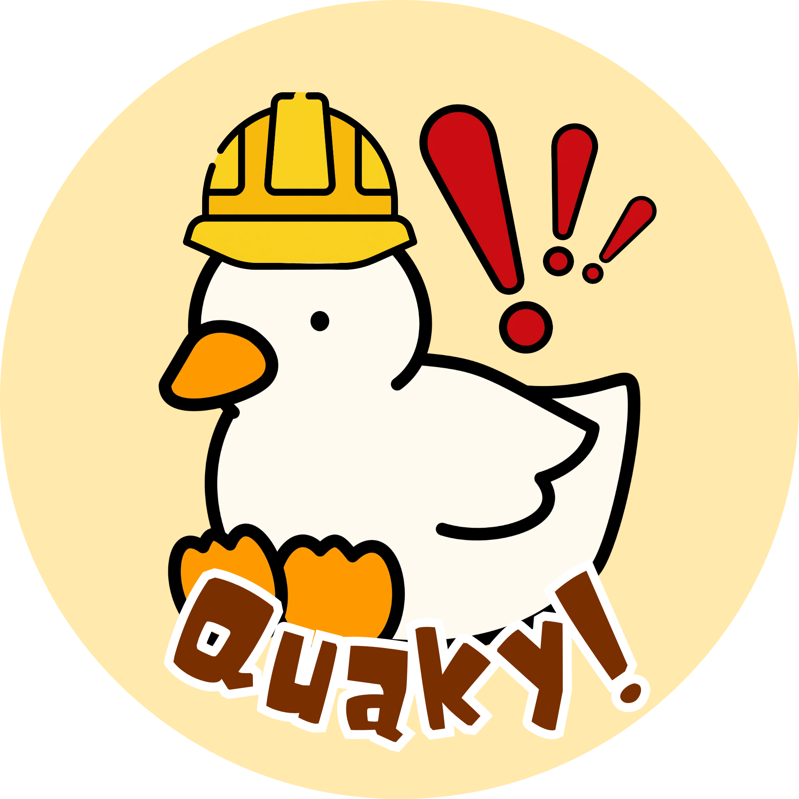
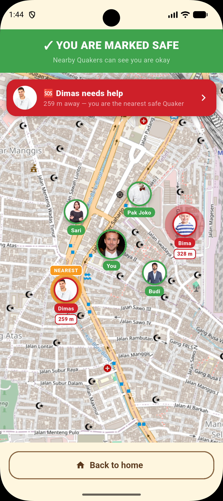
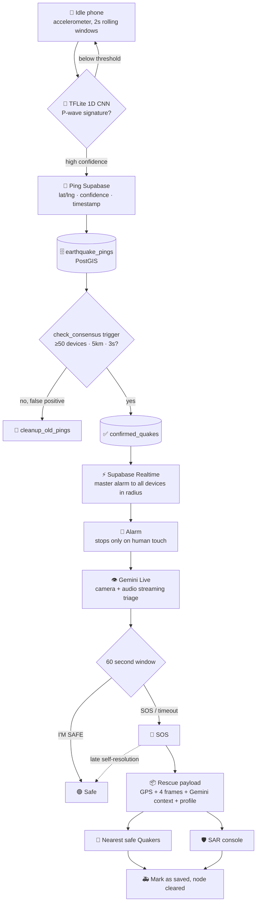

# QUAKY

### _With Quaky, Let's Save More Lives_

An earthquake companion that watches while you sleep, wakes you before the shaking peaks,
talks you through it, and makes sure somebody comes for you.

 

---

## Inspiration

One of our teammates never woke up to alarms. His mom gave up on them and started using a rubber
duck instead. Every morning she would squeeze it next to his ear, and that stupid little _quack_
did what no alarm clock ever managed: he woke up instantly, every time.

That story stuck with us, because Indonesia sits directly on the Pacific Ring of Fire and we kept
circling the same three failures.

**You are asleep.** Early warning systems exist, but they broadcast to a phone lying face down with
notifications silenced. The warning arrives and nobody hears it.

**You panic.** People who know to drop, cover and hold on will still run for a staircase, because
trained knowledge evaporates under adrenaline. What you need is not a checklist. It is a calm voice
that can see the room you are actually standing in.

**Nobody knows where you are.** When the shaking stops, rescue becomes guesswork. The neighbor 90
meters away who could have reached you in two minutes never learns you exist.

So we built the duck. Quaky stays awake so that when the ground moves, nobody is alone in it.

## What it does

Quaky turns every phone into a seismic sensor, an emergency guide, and a rescue beacon. It also
turns every user into a rescuer for the people around them. We call our users **Quakers**.

**🦆 It watches while you sleep.** The Quaky mascot dozes on your home screen. Underneath, a 1D
convolutional neural network reads the accelerometer in rolling 2 second windows, trained to spot
the rhythmic multi axis signature of P-waves (the small fast waves that arrive _before_ the
destructive ones) while ignoring walking, driving, and dropped phones. We cut microphone monitoring
from our original design: accelerometer data costs far less battery than continuous audio analysis,
and it means Quaky never listens inside your home. Privacy came free with the better engineering.

**📡 One phone is a false positive. Fifty phones is an earthquake.** When the on device model crosses
its confidence threshold, the phone sends Supabase a tiny payload: location, confidence, timestamp.
Nothing else. A PostGIS trigger then asks one question on every incoming ping: did at least 50 other
devices within 5 km also ping in the last 3 seconds? If yes, the quake is real and Supabase Realtime
pushes the master alarm to everyone in the blast radius. If no, the ping is discarded. The crowd is
the sensor, so no single phone can raise a false alarm, and no single phone has to be right.

**🚨 An alarm that refuses to be ignored.** Loud siren, red screen, shaking mascot, buzzing phone,
and no snooze. It stops only when a human being physically touches the screen, because the entire
point is turning a sleeping person into an awake one.

**👁️ Gemini Live looks around the room with you.** The moment you silence the alarm, your camera
opens and Quaky starts talking. Gemini Live streams what it sees and speaks back with instructions
about _your_ room: stay clear of that window, get under that table, there is debris in the doorway.
The screen shows exactly three things, because a panicking person cannot parse more: a 4:3 camera
feed, a 60 second countdown ring, and two palm sized buttons. While it talks, Gemini is quietly
building a written picture of your surroundings.

**🟢 Safe, or 🔴 SOS.** Tap **I'M SAFE** and you go green. Tap **SOS** and the timer is bypassed
instantly. Touch nothing at all and the timeout does it for you, because silence is the most
important signal in the app: someone who cannot answer their phone is exactly who needs rescue most.
Needed more than a minute to get somewhere safe? The **I'M SAFE** button stays on screen permanently,
even deep in SOS state, and cancels your alert the moment you press it.

**📦 The rescue payload.** A red dot tells a rescuer nothing, so going SOS broadcasts a package:
your profile photo, name, age and gender (a rescuer should know they are looking for a 7 year old,
not a 68 year old), your GPS and live distance, the last 4 frames from your camera, and Gemini's
written read of the scene: _"2nd-floor bedroom. Partial ceiling collapse, heavy debris on the floor,
shattered window on the north wall. Doorway partially blocked. Subject responsive."_

**🗣️ AI Suggestion vs User Confirmed.** Visual AI is good, not perfect. A camera can see a bedroom
and miss that you are wedged under the stairs. So Quakers in SOS can override it by voice, and the
payload carries an explicit provenance tag: amber **AI SUGGESTION**, or green **USER CONFIRMED**.
A rescuer should always know whether they are acting on a machine's guess or a human's words.

**🧡 Quakers rescue Quakers.** The nearest safe Quaker gets a targeted alert ("Dimas needs help,
140 m away, you are the nearest safe Quaker") that opens the full payload. Committing with **I'M
COMING TO HELP** draws an animated route and marks the node as covered so two people never duplicate
a rescue. Only then can you **MARK AS SAVED**, because you cannot rescue someone you never went to.
On the victim's own screen the map flips: they cannot rescue anyone, so instead they watch their
broadcast reach neighbors one by one, then watch a name and a face start moving toward them. In the
worst moment of someone's life, _"Sari is coming to help, 90 m away"_ is the whole product.

**🛡️ SAR Operations console.** Search and Rescue personnel get a pre-seeded role with no public
registration, live counters (ACTIVE SOS / SAFE / CLEARED), an incident view with every victim's full
payload, and an operations map that routes them to the nearest red node. Clearing a node updates
every counter in real time, and clearing the last one turns the whole console green. They also get
one thing citizens do not: **EMERGENCY CALL**, for direct audio contact.

## Screenshots

|                                      Community Map, Safe Mode                                       |
| :-------------------------------------------------------------------------------------------------: |
|                                                 |
| _Live Quaker statuses, the nearest SOS node highlighted with distance, and a targeted rescue alert_ |

<!-- Drop more screenshots into assets/screenshots/ and uncomment the rows you want:

| Landing | Idle, Quaky resting | Alarm |
|:---:|:---:|:---:|
|  |  |  |

| Gemini Live triage | Rescue payload | SAR console |
|:---:|:---:|:---:|
|  |  |  |

-->

## How we built it

| Layer                | Technology                     | What it does                                                         |
| :------------------- | :----------------------------- | :------------------------------------------------------------------- |
| **Mobile client**    | Flutter · Dart `^3.12.2`       | Single codebase, 60fps animation, native sensor and camera access    |
| **Edge ML**          | TensorFlow Lite (1D CNN)       | Classifies 2 second accelerometer windows on device                  |
| **ML training**      | TensorFlow · Modal             | Cloud trained on seismic waveform data, dynamic-range quantized      |
| **Backend & DB**     | Supabase (PostgreSQL)          | Auth, profiles, storage, state, with no separate server              |
| **Consensus engine** | PostGIS + SQL triggers         | Radius and time window correlation of device pings                   |
| **Realtime**         | Supabase Realtime              | Broadcasts the master alarm and SOS status instantly                 |
| **AI triage**        | Gemini Live API                | Streaming camera and audio understanding, spoken guidance            |
| **Token broker**     | Supabase Edge Functions (Deno) | Mints ephemeral Gemini tokens, so the API key never ships in the app |
| **Maps**             | `flutter_map` + OpenStreetMap  | Zero key, zero billing mapping with custom pins and routing          |
| **State**            | `provider` (ChangeNotifier)    | One state machine drives the entire emergency flow                   |
| **Motion**           | `flutter_animate`              | Every transition, pulse, and reveal                                  |

## Challenges we ran into

Teaching a phone the difference between an earthquake and a pothole was the hardest part: our first
classifier fired happily on someone jogging, because accelerometer data is overwhelmingly human
noise with a small seismic signal buried inside. That failure is why the consensus layer exists at
all. We designed the system assuming the model would sometimes be wrong, and moved the whole
correlation check into a PostGIS trigger so the database itself decides what is real, with no server
to fall over during the exact minute it matters. The UI fought us in the opposite direction: every
instinct we had was to add a mic toggle, a settings button, a label, and every time we pictured the
screen in the hands of someone whose house is shaking, we deleted it. Our hardest design work was
removing things. The strangest problem was making silence mean something, since the most important
state in Quaky is the one where the user does nothing at all, and that had to be a first class
signal rather than a timeout.

## Accomplishments that we're proud of

**We built the whole pipeline, not one slice.** A quantized 1D CNN small enough to run on a phone, a
PostGIS consensus engine with real triggers and tests, an Edge Function token broker, and a streaming
Gemini Live client with voice activity detection and a jitter buffer. Any one of those is a hackathon
project on its own.

**We turned "the AI might be wrong" into a feature.** Instead of pretending Gemini's read of a room
is always right, we tagged provenance and let a Quaker's own voice override it. Safety software
should be honest about its own uncertainty.

**A duck.** Emergency software is uniformly grim, and grim software gets uninstalled long before the
earthquake it was meant for. People keep Quaky because there is a duck asleep on the home screen,
and that duck being likeable is exactly what makes it still be installed on the night it matters.

## What we learned

**The crowd is a better sensor than any single device.** We started trying to make one phone certain
and ended up making fifty phones agree. Accuracy through consensus instead of accuracy through
precision reshaped the entire architecture.

**Not every AI problem needs the biggest model.** The tiny CNN does the life saving detection in a
rolling loop without draining the battery. Gemini gets used only where nothing smaller could work:
understanding an unfamiliar room in real time.

**Constraints are the design.** "Someone is panicking and the room is shaking" is not a UX detail you
add at the end. It rules out scrolling, menus, reading, and any button smaller than a palm. Once we
took it seriously, most of our decisions made themselves.

 

**Built for Garuda Hacks 7.0** 🇮🇩

_With Quaky, Let's Save More Lives_

